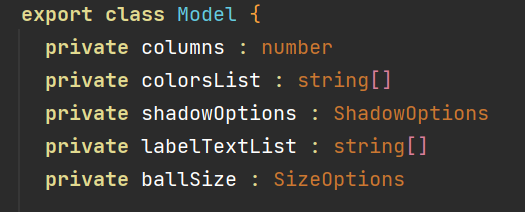

# draggablemotion

Draggable-motion allows you to use a matrix of items, in which items can be dragged and reordered, as a custom component in openHarmony.
It uses spring animation for smooth transition of items from one position to the other.

## Dependencies

For using draggablemotion in your app, add the below dependency in entry/package.json

```
"dependencies": {
    "@ohos/draggablemotion": "file:../draggablemotion"
  }
```

## Usage Instructions

Import all components at once

```ets
import { DraggableModel, Draggable} from '@ohos/draggablemotion'
```

## Class **DraggableModel.Model**
Model class has following properties.



### constructor function

```constructor(columns : number , ballSize : SizeOptions, colorsList : string[], shadowOptions? : ShadowOptions, labelTextList? : string[])```


columns, ballSize and colorsList are required parameters, rest are not.

#### ShadowOptions

`ShadowOptions {
radius : number | Resource
offsetY : number | Resource
color : Color | string | Resource
}`

offsetX is dynamically calculated for moving shadow.

### Methods
| Name | Return Type     | Description                |
| :-------- | :------- | :------------------------- |
| `setColumns(columns : number)`  | `DraggableModel.Model`  | Sets number of columns of the matrix.  |
| `getColumns()` | `number` | Returns the number of columns. |
| `setBallSize(ballSize : SizeOptions)` | `DraggableModel.Model` | Sets size of the ball. |
| `getBallSize()` | `SizeOptions` | Returns applied size of the ball. |
| `setColorsList(colorsList : string[])` | `DraggableModel.Model` | Sets the background color for the balls. The length of colorsList also determines the total number of items in the matrix |
| `getColorsList()` | `string[]` | Returns the list of applied colors. |
| `setShadowOptions(shadowOptions : ShadowOptions)` | `DraggableModel.Model` | Sets custom shadow properties |
| `getShadowOptions() ` | `ShadowOptions` | Returns applied shadow properties. |
| `setLabelTextList(labelTextList : string[])` | `DraggableModel.Model` | Specifies the text to be displayed on the matrix items |
| `getLabelTextList()` | `string[]` | Returns list of label text values. |

### Usage/Examples

```ets
import { DraggableModel, Draggable} from '@ohos/draggablemotion'

const allColors: string[] = [
  '#EF767A', '#456990', '#49BEAA', '#49DCB1', '#EEB868', '#EF767A', '#456990',
  '#49BEAA', '#49DCB1', '#EEB868', '#EF767A',
];

const text = ['A', 'B', 'C', 'D', 'E', 'F', 'G', 'H', 'I', 'J', 'K']

@Entry
@Component
struct Index {
  model : DraggableModel.Model = new DraggableModel.Model(3, {width : '50vp', height : '50vp' }, allColors).setLabelTextList(text)

  build() {
    Row() {
      Column() {
        Draggable({
          model : this.model
        })
      }
      .width('100%')
    }
    .height('100%')
  }
}
```


## Compatibility

Supports OpenHarmony API version 8 and above.

## Code Contribution

If you find any problems during usage, you can submit
an [Issue](https://github.com/Applib-OpenHarmony/Draggable/issues) to us. Of course, we also welcome you to send
us [PR](https://github.com/Applib-OpenHarmony/Draggable/pulls).

## Open source License

This project is based on [Apache License 2.0](https://github.com/kpunit020/Draggable/blob/main/LICENSE), please
enjoy and participate in open source freely.